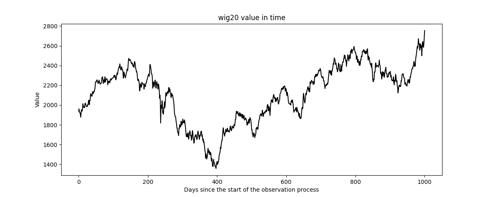
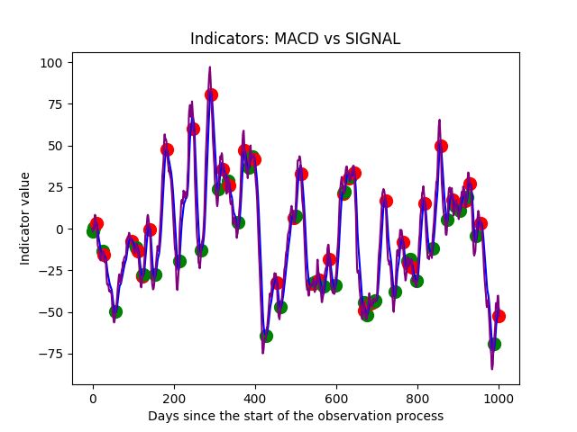
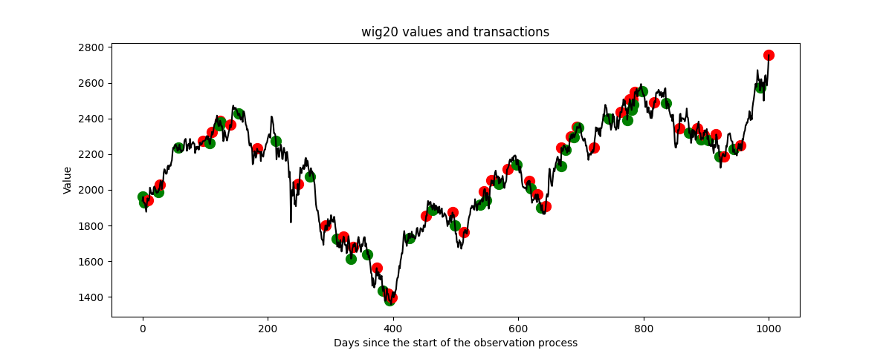
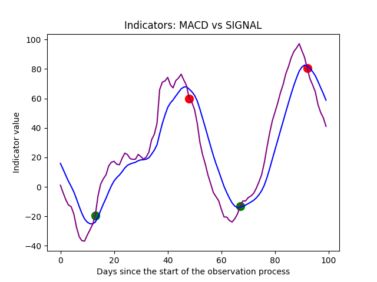
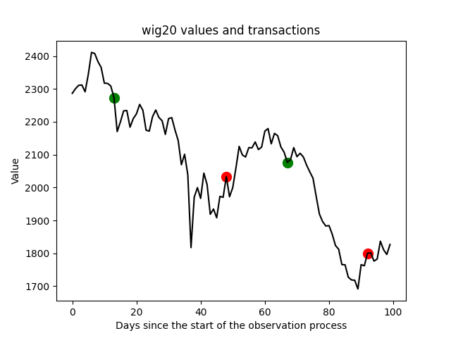
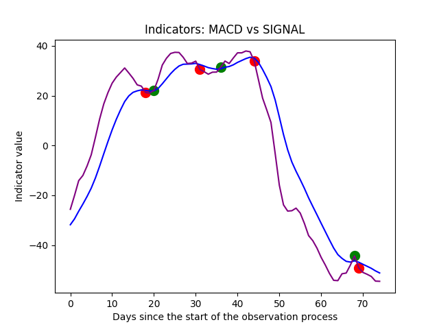
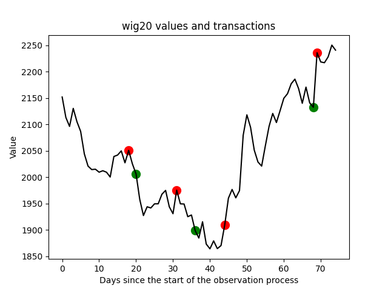
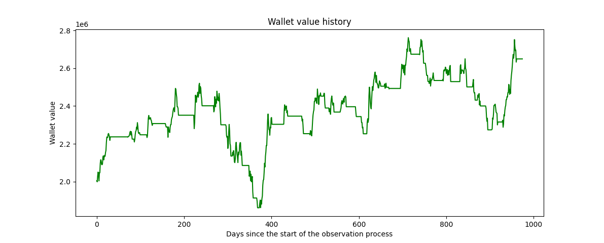

## Introduction

The program described in the following report calculates MACD and signal indicators, displays them on a chart, and performs a simulation of buying and selling the WIG20 index based on the values of these indicators.

The historical data used for this task consists of a .csv file containing the closing values of the WIG20 index for the period from March 17, 2021, to March 14, 2025.
This data was obtained from the website [stooq.com](https://stooq.com/).

The libraries numpy, pandas, and matplotlib were used to create the charts for this project.

## The analysis of usefulness of the MACD and Signal trading indicators.

### Charted data

*Chart 3.1 - WIG20 index values over time*

*Chart 3.2 - MACD and Signal Indicators*

Chart 3.1 presents the WIG20 Index values extracted from the .csv file mentioned in the introduction. All calculations, charts, and the simulation contained in this report are entirely based on this data.
Chart 3.2 presents the values of the MACD indicator – in purple – and the signal indicator – in blue. Additionally, the chart marks the moments of purchase and sale, in green and red respectively.

*Chart 3.3 - WIG20 with transactions*

Chart 3.3 contains both the WIG20 values and the transactions determined and marked on the chart in a manner analogous to Chart 3.2. Observing Chart 3.3, it can be noted that among the transactions executed during the largest fluctuations, most are profitable purchases and sales. During periods characterized by smaller fluctuations, most transactions result in losses.

### Closer look at the charts

 MACD and Signal | WIG20 with trades
----: | :----
 | 
*Chart 4.1 - MACD and Signal indicators during days 200-300* | *Chart 4.2 - WIG20 with transactions during days 200-300*
 | 
*Chart 4.3 - MACD and Signal indicators during days 600-675* | *Chart 4.4 - WIG20 with transactions during days 600-675*

The relationship between the MACD and signal indicators is intended to help identify trends in the value changes of the measured instruments. In the pairs of charts above, it can be observed that changes in the WIG20 value are not predicted by these indicators. This may result from the low frequency of the analyzed data. The data used for the calculations are the index values at daily market closing times. It is possible that the rates of price changes, which the indicators are meant to show, are not visible in single data points selected cyclically once a day and would be better reflected by the indicator values if they were placed in the context of WIG20 values from the rest of the trading day.

The purchase and sale decisions made based on the data analyzed in the excerpts from the 4 charts are mostly unprofitable. In Charts 4.1a and 4.1b, both sales result in losses relative to the previous purchases. Similarly, in Charts 4.2a and 4.2b, almost all sales are unprofitable; moreover, they seem to miss numerous declines and increases. The transaction moments do not appear to be related to the index value. A clear exception is the last transaction in Chart 4.2b. Nevertheless, based on the limited data presented in the charts above, it can be concluded that these indicators do not seem useful for making investment decisions, at least with high transaction frequency and low sampling frequency of instrument prices.

## Simulation

At the start of the simulation, the portfolio contains 1,000 units of the WIG20 index, which translates to a value of 2,005,100 monetary units. Purchase and sale decisions were made solely based on the MACD and signal calculated from the daily WIG20 index data described in the introduction. When buying, the maximum possible amount of the index is purchased, and when selling, all held assets are sold.

During the simulation, the automated portfolio executed 37 buy and sell transactions, of which 14 pairs resulted in profits and 23 resulted in losses.

Profitable transactions generated a total profit of 1,931,340 monetary units, while unprofitable transactions generated a total loss of 1,311,666 monetary units.

The final portfolio value is 2,649,314 monetary units, yielding a profit of 644,214 monetary units.

For comparison, buying 1,000 units of the WIG20 on March 17, 2021, at a price of 1,939.01 monetary units per index unit and selling them on March 14, 2025, at a price of 2,754.38 would have yielded a profit of 815,370 monetary units. This means that by choosing this strategy, the portfolio lost 171,156 (~21%) of potential profits.

1 chart

*Chart 5.1 Daily valuation of the investment portfolio based on the WIG20 index price for that day*

Interestingly, despite frequent transactions, the portfolio's value appears to depend on the value of the index itself. This is because the value of the held assets naturally follows the price trends of those assets. The portfolio value can therefore only rise and fall with the WIG20 price, or maintain a constant value by holding only cash. In the case of the aforementioned inaccuracies resulting from low data sampling frequency, the portfolio value will follow the trends of the observed index.

## Conclusions

From the above analysis, it can be concluded that for the chosen data, following the method of observing the crossovers of the MACD and signal indicators is ineffective. This may be due to inaccuracies in their operation caused by the low frequency of data sampling. During the simulation of a portfolio using this investment method, the portfolio's value increased and decreased along with the value of the observed index. Unfortunately, this method doesn't beat the market - using it is less effective than buying the index and selling it after the simulation period has elapsed.